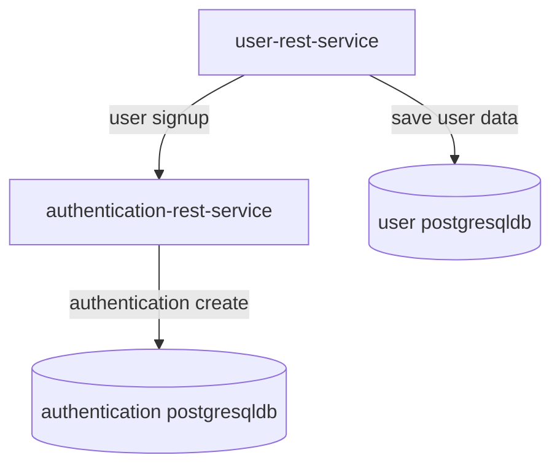
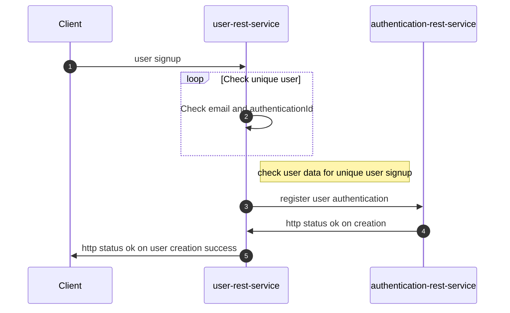
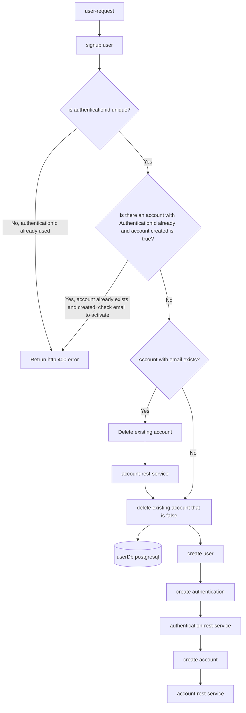

# user-rest-service
This is user-rest-service for managing user data.
This service exposes a user signup api.  This will save the user
and create a Authentication account using the Authentication API.
This service requires a API key.

## Mermaid diagrams

The following is the flowchart showing component dependency for user-rest-service:



The following is the user sign-up sequence diagram:



## Run locally

```
mvn spring-boot:run -Dspring-boot.run.arguments="--server.port=8084 \
    --POSTGRES_USERNAME=test \
    --POSTGRES_PASSWORD=test \
    --POSTGRES_DBNAME=user \
    --POSTGRES_SERVICE=localhost:5432
    --DB_SSLMODE=disable
    --eureka.client.enabled=false"                       
```
 
 
## Build Docker image

Build docker image using included Dockerfile.


`docker build -t ghcr.io/<username>/user-rest-service:latest .` 

## Push Docker image to repository

`docker push ghcr.io/<username>/user-rest-service:latest`

## Deploy Docker image locally

`docker run -e POSTGRES_USERNAME=dummy \
 -e POSTGRES_PASSWORD=dummy -e POSTGRES_DBNAME=account \
  -e POSTGRES_SERVICE=localhost:5432 \
 -e apiKey=123 -e DB_SSLMODE=DISABLE
 --publish 8080:8080 ghcr.io/<username>/user-rest-service:latest`


## Installation on Kubernetes
Use my Helm chart here @ [sonam-helm-chart](https://github.com/sonamsamdupkhangsar/sonam-helm-chart):

```
helm install user-rest-service sonam/mychart -f values-backend.yaml --version 0.1.15 --namespace=yournamespace
```

## Instruction for port-forwarding database pod
```
export PGMASTER=$(kubectl get pods -o jsonpath={.items..metadata.name} -l application=spilo,cluster-name=project-minimal-cluster,spilo-role=master -n yournamesapce); 
echo $PGMASTER;
kubectl port-forward $PGMASTER 6432:5432 -n backend;
```

### Login to database instruction
```
export PGPASSWORD=$(kubectl get secret <SECRET_NAME> -o 'jsonpath={.data.password}' -n backend | base64 -d);
echo $PGPASSWORD;
export PGSSLMODE=require;
psql -U <USER> -d projectdb -h localhost -p 6432

```
### Send post request to create user account
```
 curl -X POST -json '{"firstName": "dummy", "lastName": "lastnamedummy", "email": "yakApiKey", "authenticationId": "dummy123", "password": "12", "apiKey": "APIKEY"}' https://user-rest-service.sonam.cloud/signup
```

## Signup User workflow


## Update User workflow


## Update profilephoto


## Get user by authenticationId


## find matching name


## activate user


## delete user


